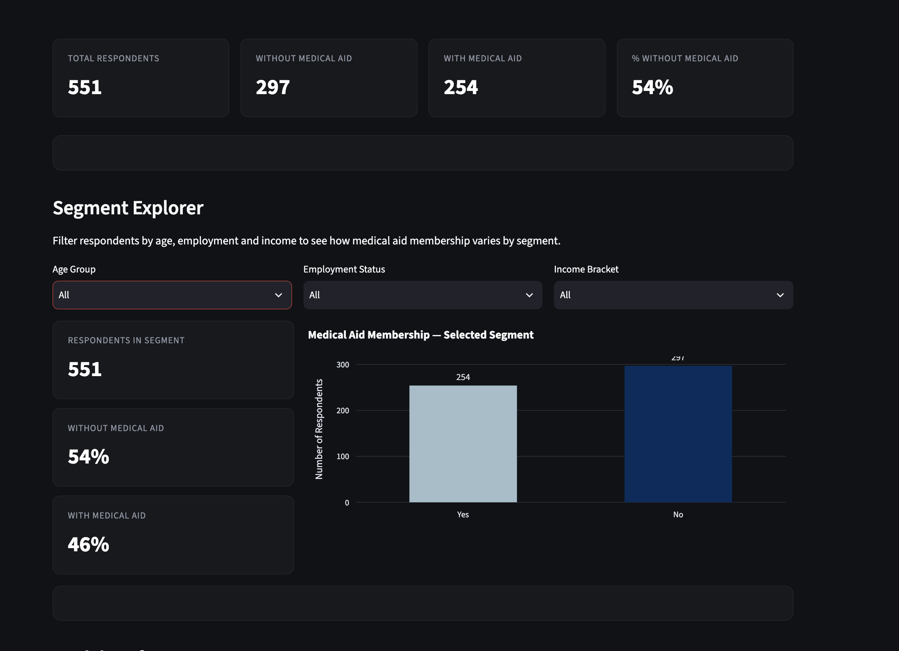

# Predicting Medical Aid Uptake Among Young Namibians

**M.Sc. Data Science capstone · University of Europe for Applied Sciences, Berlin**
Built for **Namibia Medical Care (NMC)** to understand why young people don't sign up for medical aid, and what would change that.

**[Live dashboard](https://trdt2hfg7vsrgfmykynypf.streamlit.app/)**



## The problem
Young, healthy members are the most valuable group for a medical aid fund because they rarely claim, but they are also the hardest to sign up. NMC needed evidence on what drives and blocks uptake among 18–35-year-olds.

## Data
- Primary survey I designed and ran: **553 responses**, 551 usable after cleaning
- Covers demographics, employment and income, awareness of NMC, willingness to pay, desired benefits and open-text answers
- No names or contact details were collected

## Approach
1. **Cleaning and feature engineering** of survey responses (pandas)
2. **Classification:** predicted likelihood to sign up with Logistic Regression, Random Forest and XGBoost (scikit-learn, XGBoost)
3. **Text analysis:** sentiment analysis (TextBlob) and LDA topic modelling (Gensim) on open-text answers
4. **Dashboard:** interactive Streamlit app with Plotly charts for NMC's marketing team

## Results

Test set: 111 respondents, balanced classes (54 / 57).

| Model | Accuracy | Macro F1 |
|---|---|---|
| Logistic Regression | 0.91 | 0.91 |
| Random Forest | 0.88 | 0.88 |
| **XGBoost** | **0.92** | **0.92** |

XGBoost was selected for the dashboard.

## Key findings
- **Willingness to pay** is by far the strongest predictor of uptake.
- Most respondents would pay **under N$500/month**, below NMC's entry-level price of **N$735**.
- **38%** of open-text responses were negative, with cost frustration as the main theme.
- Four topics emerged: perceived expensiveness, cost and benefit awareness, unemployment as a structural barrier, and general avoidance.

## Business impact
The findings shaped NMC's youth acquisition strategy, messaging and creative. The campaign has generated nearly **2,000 leads and 400+ member sign-ups** to date.

## Repository contents
| File | Description |
|---|---|
| `Capstone Project.ipynb` | Full analysis: cleaning, modelling, evaluation, text analysis |
| `app.py` | Streamlit dashboard |
| `NMC_survey_cleaned.csv` | Cleaned, anonymised survey data |
| `model_rf.pkl` | Trained XGBoost model used by the dashboard |
| `feature_names.pkl` | Feature names used by the dashboard |
| `requirements.txt` | Python dependencies |

## Run locally
```bash
git clone https://github.com/Rauna-creator/MSc-Capstone-Project.git
cd MSc-Capstone-Project
pip install -r requirements.txt
streamlit run app.py
```

## Built with
Python · pandas · scikit-learn · XGBoost · NLTK · TextBlob · Gensim · Streamlit · Plotly · Matplotlib · Seaborn · Jupyter

**Author:** Rauna NP Nghidipaa · [LinkedIn]([https://www.linkedin.com/in/raunanp](https://www.linkedin.com/in/rauna-nghidipaa-88b806151/?isSelfProfile=true))
